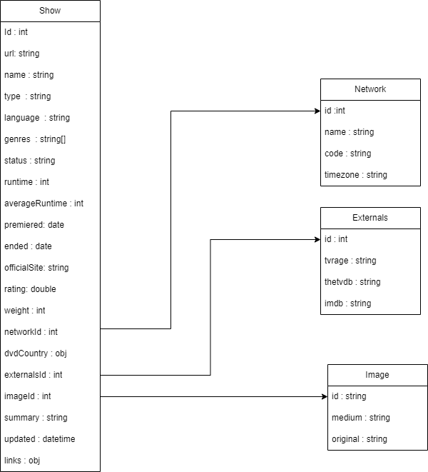

# DEL 2 Database baserte spørsmål.

## Beskrivelse av TV-Maze Database tabeller. Antagelse er at det er en Relasjons Database.

Her ser vi tilkobling mellom Show, Network, Image og Externals tabeller. Vi ser hvordan ting henger sammen og hvilke type verdier de har bassert på informasjon som vi får ved å se på respons fra TV-Maze api.
## Eksempler for å hente ut informasjon fra flere  tabeller samtidig:
    1. Bruk inner join for å hente ut informasjon som bare finnes i begger tabeller. 
        - Eksempel: (SELECT Show.id, Show.name, image.medium AS image, Network.name AS network
                        FROM Show
                        JOIN Network ON Show.networkId = Network.id
                        JOIN Image ON Show.imageId = Image.id
                        WHERE Show.id = 1; )

    2. Bruk left join (eller Right join) for å hente ut informasjon i venstre (eller høyre) tabel, men kanskje har ikke representativ data på høyre (eller venstre) tabel.
        - Eksempel: (SELECT *
                        FROM Show
                        LEFT JOIN Image ON Show.imageId = Image.id; )
## Eksempler for å hente ut mindre antall data:
    - Gitt at vi bare en del av data, så vil jeg brukt LIMIT og/eller OFFSET inn i query for å si akkurat hvor mye skal jeg hente ut. Grunnet til at jeg tenker det er en bra løsning i den situasjonen, er fordi data som finnes inn i databasen bruker sequencial id, som betyr at hver nye input får id med 1 høyre enn den siste verdien som ble satt inn.
        - Eksempel 1: (SELECT *
                        FROM Show
                        JOIN Image ON Show.imageId = Image.id
                        LIMIT 250; )
        - Eksempel 2: (SELECT *
                        FROM Show
                        JOIN Image ON Show.imageId = Image.id
                       LIMIT 250 OFFSET 250; ) 
